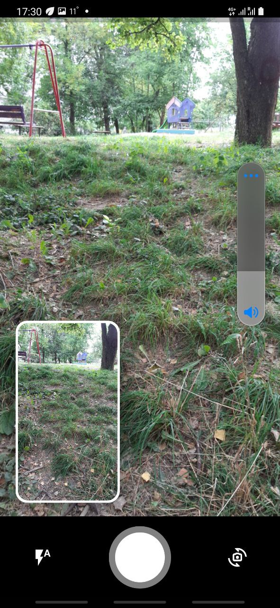

# Camera Bloc 
Interface for camera 

| Portrait                            |   Landscape                            | 
| ------------------------------------- |:-------------------------------------:| 
|    |  | 

# Guide for instalation

## Android

You need add in **app/build.gradle**

```dart
minSdkVersion 21
```

## IOS

You need add in **info.plist**

```dart
  	<key>NSCameraUsageDescription</key>
    <string>Can I use the camera please?</string>
    <key>NSMicrophoneUsageDescription</key>
    <string>Can I use the mic please?</string>
```

## Flutter

Add package in pubspec.yaml

```yaml
camera_bloc: current_version
```

## How to use

Camera_Bloc is widget, you can use anywhere

Example 01

```dart
return Scaffold(
      body: CameraScreen(
        onTakePhoto: (file) => print(file);
      )
);
```


## Roadmap 

| Feature               | Progress |
| :-------------------- | :------: |
| Zoom                  |          |
| Flash                 |    ✅    |
| CameraSide select     |    ✅    |
| Add Exposure controll |          |
| Add Easy Mode Video   |          |

## Contributing

Pull requests are welcome. For major changes, please open an issue first to discuss what you would like to change.

Please make sure to update tests as appropriate.

## License

[MIT](https://choosealicense.com/licenses/mit/)
